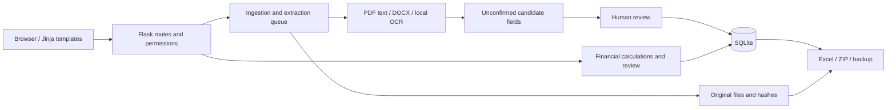

# Contract Ledger

A local-first contract archive and financial reconciliation application built with Python, Flask and SQLite. It connects source documents to human-reviewed records, payments and invoices while preserving the evidence behind each entry.

This repository is a portfolio edition of a business-workflow project. It includes application code, synthetic demonstration data generation and automated tests. It contains no operational database or original business contracts. The current application interface is in Chinese; the technical documentation and demo walkthrough are in English.

## Why this project

Contract files and spreadsheets can become disconnected: a document may exist without a confirmed amount, a payment may cover only part of a contract, and OCR can suggest incorrect fields. This project explores how document processing, relational modelling and review workflows can make those uncertainties visible.

## Implemented capabilities

- Upload PDF, DOCX and image files; preserve originals and calculate SHA-256 hashes.
- Extract text locally with PDF parsing and RapidOCR; keep suggested values separate from confirmed fields.
- Review contract metadata and maintain receivable and payable amounts in integer minor units.
- Record receipts, payments and invoices; retain voided entries and their correction reasons.
- Summarise by counterparty and currency without combining incompatible currencies or offsetting unrelated overpayments.
- Detect stale payment confirmations after financial records change.
- Filter records and export Excel workbooks or ZIP archives with manifests.
- Authenticate users with Argon2 password hashing, enforce administrator permissions and CSRF protection, and detect conflicting edits.
- Archive and restore documents; create consistent backups and verify original-file hashes.

## Quick start (Windows, Python 3.12)

Run these commands from the repository root after installing Python 3.12:

```powershell
py -3.12 -m venv .venv
.\.venv\Scripts\python.exe -m pip install -r requirements-lock.txt
.\.venv\Scripts\python.exe -m contractdb serve --host 127.0.0.1 --port 8000
```

Open <http://127.0.0.1:8000>, create the first administrator locally, and log in. Choose your own password of at least 10 characters. If port 8000 is occupied, use `--port 8001`. Stop the foreground server with Ctrl+C.

For a populated demonstration, run the following **before starting the server**, in a fresh copy with no `data` directory contents:

```powershell
.\.venv\Scripts\python.exe scripts/demo.py
```

The script asks for a new password, creates a `demo-admin` account and imports three wholly synthetic DOCX fixtures through the application's normal routes. It refuses a nonempty data directory and refuses an external `CONTRACTDB_DATA_DIR`. Then start the server using the command above. See [Demo walkthrough](docs/DEMO.md).

Alternatively, with uv installed: `uv sync --locked --extra test`, then `uv run python -m contractdb serve --host 127.0.0.1 --port 8000`.

## Verification

```powershell
.\.venv\Scripts\python.exe -m pytest -q
.\.venv\Scripts\python.exe -m contractdb verify
```

Tests generate their own fixtures in temporary directories. The OCR integration test currently requires the Windows Microsoft YaHei font. The included GitHub Actions workflow therefore uses Windows and Python 3.12. Cloud execution is only confirmed when your repository's Actions run succeeds. See [validation evidence and limits](docs/VALIDATION.md).

## Architecture



| Area | Entry points |
| --- | --- |
| Web application and access control | `contractdb/web.py`, `templates/`, `static/` |
| Storage and audit trail | `contractdb/db.py`, `service.py` |
| Local text extraction | `contractdb/extract.py` |
| Financial rules | `contractdb/finance.py`, `ledger.py` |
| Integrity and exports | `contractdb/backup.py`, `file_archive.py`, `folder_export.py` |
| Extended model and migration tooling | `contractdb/schema.py`, `migrations.py` |
| Workflow and OCR tests | `tests/` |

Read [Engineering decisions](docs/ENGINEERING.md) for trade-offs, current model boundaries and future work, and [Project case study](docs/CASE_STUDY.md) for an admissions-oriented discussion.

## Scope and limitations

This is a local/trusted-network application, not a hosted accounting service or a replacement for professional accounting controls. The documented launch binds to loopback. Internet deployment needs a separate security and deployment review, including HTTPS. GitHub Pages cannot execute this Python backend.

The OCR pipeline uses a pretrained third-party model and heuristic extraction, not a model trained for this project or an LLM. PDF extraction is limited to the first 30 pages and OCR to up to six low-text pages within that range. Unknown amounts are not zero; outstanding contractual balances do not establish overdue debts. There is no measured OCR benchmark, production-scale performance claim or independent security audit.

## Data and authorship

Do not commit contracts, exports, backups, account databases or session keys. `.gitignore` provides additional protection but does not remove previously committed files. The demo is fictional and must not be described as real financial evidence.

AI coding assistance was used during development and portfolio preparation. The repository does not establish which components the applicant personally implemented. Any CV or personal statement should accurately identify their own requirements work, implementation, testing and reflection. See [application guidance](docs/APPLICATION_GUIDE_ZH.md).

No licence grant is included in this edition. The owner should choose a licence only after confirming the right to publish and license the code; third-party dependencies keep their own licences.
